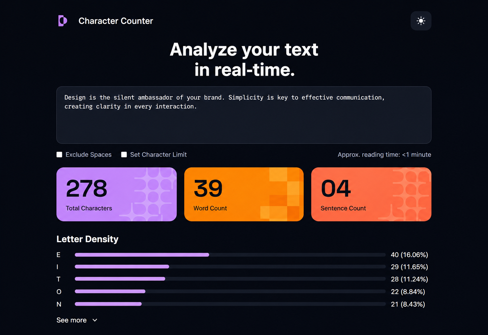
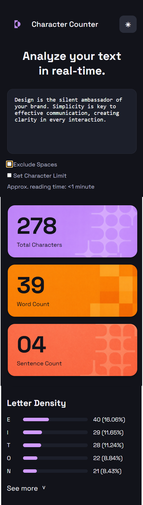
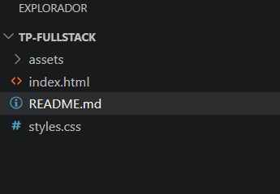

# Character Counter

## 1. Objetivo del proyecto

El objetivo de este proyecto fue replicar visualmente una interfaz web de análisis de texto utilizando únicamente HTML y CSS, sin incorporar JavaScript. Se buscó respetar el diseño de referencia proporcionado por la cátedra, aplicando buenas prácticas de maquetado semántico, diseño responsive y organización del código.

---

## 2. Tecnologías utilizadas

* HTML5 — estructura semántica del sitio.
* CSS3 — estilos visuales, Flexbox, variables CSS y diseño responsive.
* Google Fonts — tipografía Space Grotesk.
* Git y GitHub — control de versiones y gestión del repositorio.
* Visual Studio Code — editor de código utilizado durante el desarrollo.

---

## 3. Cómo organicé el HTML

El archivo `index.html` fue organizado en secciones para facilitar la lectura y el mantenimiento del código.

### Header

Contiene:

* Logo del proyecto.
* Nombre del sitio "Character Counter".
* Botón de cambio de tema (modo visual).

### Hero

Incluye:

* Título principal:
  "Analyze your text in real-time."
* Área de texto implementada mediante un elemento `<textarea>`.

### Controls

Contiene:

* Checkbox "Exclude Spaces".
* Checkbox "Set Character Limit".
* Texto informativo sobre el tiempo estimado de lectura.

### Stats

Sección formada por tres tarjetas informativas:

* Total Characters.
* Word Count.
* Sentence Count.

Cada tarjeta contiene un valor numérico estático y una descripción.

### Letter Density

Incluye:

* Título de sección.
* Barras de progreso visuales para representar la densidad de letras.
* Cantidad y porcentaje correspondientes a cada letra.
* Botón "See More".

---

## 4. Cómo resolví el CSS

El archivo `styles.css` fue organizado siguiendo una estructura lógica:

1. Variables CSS (`:root`).
2. Reset general.
3. Estilos globales.
4. Header.
5. Hero.
6. Controls.
7. Stats.
8. Letter Density.
9. Botón "See More".
10. Responsive Design.

Para el diseño utilicé:

* Variables CSS para centralizar colores y facilitar modificaciones futuras.
* Flexbox para la distribución de elementos.
* Box Shadow para generar profundidad visual.
* Border Radius para lograr esquinas redondeadas.
* Hover Effects para mejorar la interacción visual.
* Media Queries para adaptar el sitio a dispositivos móviles.

Las barras de progreso de la sección Letter Density fueron realizadas mediante elementos `div` estilizados, simulando barras de progreso mediante porcentajes de ancho.

Las tarjetas de estadísticas utilizan imágenes decorativas de fondo para asemejarse al diseño de referencia entregado en la consigna.

---

## 5. Dificultades encontradas

### Vinculación del archivo CSS

Durante el desarrollo los estilos no se reflejaban correctamente en el navegador debido a que faltaba enlazar el archivo `styles.css` dentro del `<head>` mediante:

```html
<link rel="stylesheet" href="styles.css">
```

Una vez agregado el enlace, los cambios comenzaron a visualizarse correctamente.

### Organización del contenedor principal

En una etapa del desarrollo algunos elementos aparecían desordenados porque las secciones no estaban ubicadas correctamente dentro del contenedor principal (`container`). Fue necesario reorganizar la estructura HTML para recuperar el diseño esperado.

### Adaptación Responsive

Fue necesario ajustar el comportamiento de Flexbox mediante Media Queries para evitar problemas de distribución en pantallas pequeñas y mejorar la visualización en dispositivos móviles.

### Uso de imágenes de fondo

Las tarjetas de métricas utilizan imágenes decorativas como fondo. Fue necesario ajustar propiedades como:

* `background-size`
* `background-position`
* `background-repeat`

para lograr una apariencia similar a la referencia proporcionada.

---

## 6. Commits

Durante el desarrollo se realizaron commits progresivos siguiendo buenas prácticas de Git.

Se utilizaron mensajes descriptivos utilizando convenciones como:

* `feat` para nuevas funcionalidades o estructuras.
* `style` para cambios visuales.
* `fix` para correcciones de errores.
* `docs` para documentación.

Ejemplos:

* feat: estructura HTML inicial
* feat: implementar encabezado
* feat: agregar textarea para ingreso de texto
* style: agregar paleta de colores
* style: crear diseño de tarjetas
* style: adaptar diseño para dispositivos móviles
* fix: corregir estructura del container
* docs: agregar README

---

## 7. Capturas del resultado final


### Vista Desktop



### Vista Mobile



### Estructura del proyecto en VSCode



---

## Autor

Ramón More
